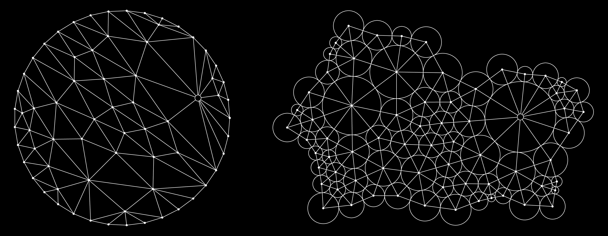
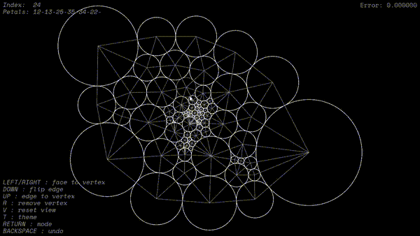

# Circlepack openFrameworks project
## About
An app to create and and edit circle packings in openFrameworks with C++. The app allows for manipulation of a graph which is a triangulation of a closed topological disc and computing its circle packing with given boundary conditions.

<!--  -->


There are two modes in computing the packing, the first fixes the labels (radii) of the boundary vertices (circles) while the second fixes the 'angle sums' of the boundary vertices. The angle sum of a vertex is the sum of the angles it make with the center of each mutually adjacent pair of its petals (neighbours), see ([^1]) for more information.

The main algorithm used to compute the circle packing is based on an implementation of a paper by Collins and Stephenson[^1].




<!-- 
The animation is generative, that is, changing the random seed will result in a different outcome.
In the original version I experimented with many kinds of cube movements, but in the end I stuck with rolling and 'unsquishing' and have only included these in this implementation. To change the 'plot' of the animation, play around with the `submit_...` functions in `ofApp::setup` (in `ofApp.cpp`), or modify / create such functions in `Patterns.h`.

This project was created with some creative and technical input from [@Bleuje](https://www.github.com/Bleuje). -->

[^1] = [https://doi.org/10.1016/S0925-7721(02)00099-8](https://doi.org/10.1016/S0925-7721(02)00099-8)

## Usage

### Both modes
| Input | Description |
| ----------- | ----------- |
| **BACKSPACE** | Undo graph edit |
| **RETURN** | Toggle mode |
| **T** | Toggle theme |
| **V** | Reset view |
### 'Fixed boundary labels' mode
| Input | Description |
| ----------- | ----------- |
| **LEFT CLICK** | Select first vertex |
| **RIGHT CLICK** | Select second vertex |
| **R** | Remove vertex |
| **DOWN** | Flip edge |
| **UP** | Replace edge with new vertex |
| **LEFT/RIGHT** | Add new vertex in a face |
### 'Fixed boundary angle' mode
| Input | Description |
| ----------- | ----------- |
| **LEFT CLICK** | Select vertex |
| **UP/DOWN** | Increase/decrease boundary angle |
| **LEFT/RIGHT** | Navigate boundary vertices |

<!-- | **R** | Remove vertex | -->
<!-- | **Escape** | **quit** the app |
| arrows **up** / **down** (or **W** / **X**)   | function selection navigation / change cursor position |
| arrows **left** / **right** (or **C** / **V**)  | change function at cursor |
| **S** | **save** picture (with timestamp in filename), also saves the list of functions in a text file. Both in "data/images" folder | 
| **Q** | randomize parameters of function at cursor (not possible for all variations) |
| **Y** | randomize parameters of all functions |
| **Z** | change all functions randomly |
| **F** / **D** | add / remove function above cursor |
| **P** / **O** | add / remove function at the end of the list |
| **N** | change **color** mode |
| **!** (exclamation mark) | activate/deactivate the **3D mode** |
| **E**| change "bounding mode" of drawing | -->


## Compile and run

You need to have openFrameworks installed to compile this project. Find setup guides for openFrameworks projects here: [https://openframeworks.cc/download/](https://openframeworks.cc/download/)

To compile and run: 
```
make -j6 && make run
```
or, for console and text output:
```
make -j6 && make run | tee output.txt
```

To enable running the program by double-clicking the exe file, copy the required DLLs:
```
make copy_dlls
```


