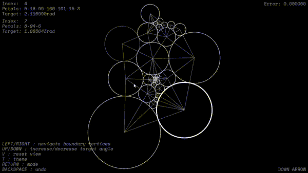

# Circlepack openFrameworks project
## About
An app to create and and edit circle packings in openFrameworks with C++. The app allows for manipulation of a graph which is a triangulation of a closed topological disc and computing its circle packing with given boundary conditions.

<!--  -->


There are two modes in computing the packing, the first fixes the labels (radii) of the boundary vertices (circles) while the second fixes the 'angle sums' of the boundary vertices. The angle sum of a vertex is the sum of the angles it make with the center of each mutually adjacent pair of its petals (neighbours), see ([^1]) for more information.

The main algorithm used to compute the circle packing is based on an implementation of a paper by Collins and Stephenson[^1].




<!-- 
The animation is generative, that is, changing the random seed will result in a different outcome.
In the original version I experimented with many kinds of cube movements, but in the end I stuck with rolling and 'unsquishing' and have only included these in this implementation. To change the 'plot' of the animation, play around with the `submit_...` functions in `ofApp::setup` (in `ofApp.cpp`), or modify / create such functions in `Patterns.h`.

This project was created with some creative and technical input from [@Bleuje](https://www.github.com/Bleuje). -->

[^1] = [https://doi.org/10.1016/S0925-7721(02)00099-8](https://doi.org/10.1016/S0925-7721(02)00099-8)

## Usage

## Functions
### Remove vertex
Select a vertex and delete it. If the selected vertex is an interior vertex, fill the void it creates by connecting its petals in a zig-zag fashion. If deleting a vertex leaves a neighbour with only two petals remaining, it is also removed (this might also lead to subsequent deletions).


### Flip edge
Select two vertices, with at least one being interior, then they have two mutual petals. This function disconnects the two selected vertices and connects their two mutual petals.


### Replace edge with new vertex
Select two vertices. This function disconnects them and adds a new vertex, this vertex is connected both selected vertices and any mutual petals of the selected vertices.


### Add new vertex in a face
Select two vertices. These two vertices have two mutual petals (one if they're both boundaries) that makes a face (triangle). This function adds a new vertex connected to the three vertices of the chosen face.


### Both modes
| Input | Description |
| ----------- | ----------- |
| **BACKSPACE** | Undo graph edit |
| **RETURN** | Toggle mode |
| **T** | Toggle theme |
| **V** | Reset view |
| **P** | Print graph info to console |
### 'Fixed boundary labels' mode
| Input | Description |
| ----------- | ----------- |
| **LEFT CLICK** | Select first vertex |
| **RIGHT CLICK** | Select second vertex |
| **R** | Remove vertex |
| **DOWN** | Flip edge |
| **UP** | Replace edge with new vertex |
| **LEFT/RIGHT** | Add new vertex in a face |
### 'Fixed boundary angles' mode
| Input | Description |
| ----------- | ----------- |
| **LEFT CLICK** | Select vertex |
| **UP/DOWN** | Increase/decrease boundary angle |
| **LEFT/RIGHT** | Navigate boundary vertices |
| **0**-**9** | Set boundary targets to n-gon |


## Compile and run

You need to have openFrameworks installed to compile this project. Find setup guides for openFrameworks projects here: [https://openframeworks.cc/download/](https://openframeworks.cc/download/)

To compile and run: 
```
make -j6 && make run
```
or, for console and text output:
```
make -j6 && make run | tee output.txt
```

To enable running the program by double-clicking the exe file, copy the required DLLs:
```
make copy_dlls
```


